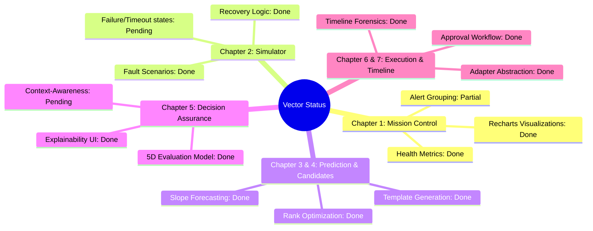

# Vector PRD Gap Analysis & Project Status

This document presents a detailed audit of the **Vector** (AI Decision Intelligence & Assurance Platform for Autonomous Infrastructure) implementation against its Product Requirements Documents (PRD Volume 1 & Volume 2).

---

## 📊 Summary Dashboard

Here is a visual state breakdown of the platform components:

---

## 🔍 Detailed Component Alignment

Below is the module-by-module compliance grid mapping the detailed specifications of **Volume 2** to the existing implementation:

| Chapter | Module | Core Requirements | Implementation Status | Notes / Polish Needed |
| :--- | :--- | :--- | :---: | :--- |
| **Ch 1** | **Mission Control Dashboard** | Overall Health Score, KPI Cards (CPU, Mem, Net, Latency, Pods, Nodes), Interactive charts, Active predictions, live alert logs. | **90% Complete (POLISH)** | <ul><li>[x] Live stats update via polling every 4s.</li><li>[ ] **Alert Grouping**: Group alerts visually by CRITICAL/WARNING in the sidebar rather than just sorting them.</li><li>[ ] **Error State**: Handle empty metrics states if uvicorn server fails.</li></ul> |
| **Ch 2** | **Incident Simulator** | One-click triggers for `CPU_SPIKE`, `MEMORY_LEAK`, `TRAFFIC_SURGE`, `POD_CRASH`, `NODE_FAILURE`. Duration settings, dynamic status registry, manual stop/recover. | **85% Complete (POLISH)** | <ul><li>[x] Fault injection scales/leaks telemetry metrics.</li><li>[x] Restoring baseline via "Recover" button.</li><li>[ ] **Recovery Timeout**: Missing simulation of delayed or failed recoveries (currently transitions instantly).</li></ul> |
| **Ch 3** | **Prediction Engine** | Telemetry slope calculation, 300s projection window, Risk & Confidence categorization, timeline alert triggers. | **95% Complete (DONE)** | <ul><li>[x] Fits linear regression to CPU/Memory/Latency.</li><li>[x] Triggers prediction events in database timeline.</li><li>[ ] **Low Confidence**: Explicit UI warning tags for predictions with confidence scores below 80%.</li></ul> |
| **Ch 4** | **Candidate Action Generator** | Recommendation templates (Scale, Restart, Migrate, Configuration), template mapping per failure mode, rank/cost metadata. | **95% Complete (DONE)** | <ul><li>[x] Proposes logical candidates with cost (High/Med/Low).</li><li>[x] Persists actions in SQLite DB.</li></ul> |
| **Ch 5** | **Decision Assurance Engine** | 5D evaluation model (Confidence, Risk, Policy Compliance, Digital Twin simulation, and Rollback readiness). Weighted Decision Score. | **80% Complete (TO FINISH)** | <ul><li>[x] Detailed explainability charts in Decision Center UI.</li><li>[x] Digital twin before/after metrics projections.</li><li>[ ] **Architectural Gap**: The recommended **Decision Context Service** from Chapter 8 is not yet implemented (evaluations are strictly static rule-based calculations).</li></ul> |
| **Ch 6** | **Execution Engine & Policy Center** | Policy settings console (sliders, toggles), Auto Execute vs Human Approval, K8s Adapter execution client (Mock vs Live modes). | **85% Complete (POLISH)** | <ul><li>[x] Policy modifications immediately persist to DB.</li><li>[x] Action approval/rejection triggers real mock cluster scales.</li><li>[ ] **Live Adapter Completeness**: Prometheus metric fetch contains static placeholders for Memory, Network, and Latency instead of live queries.</li></ul> |
| **Ch 7** | **Decision Timeline & Audit System** | Append-only event registry, grouping by distinct incident timelines, expandable JSON forensic payloads. | **100% Complete (DONE)** | <ul><li>[x] Fully functional visual audit log with expandable pre tags showing details.</li><li>[x] Stored in SQLite database.</li></ul> |

---

## 🛠️ Key Areas to Polish & Finish

Based on the alignment audit, here are the concrete enhancement items we should focus on:

### 1. Architectural: Decision Context Service [TO FINISH]
- **Goal**: Introduce a dedicated middleware/service that feeds the Decision Assurance Engine.
- **Action**: Implement a `DecisionContextService` that enriches candidate actions with:
  - *Service Criticality* (Critical vs High vs Medium).
  - *Current Maintenance Window* (business hours lockouts).
  - *Resource Availability* (nodes utilization).
  - *Historical Incident Counts*.

### 2. UI/UX: Alert Grouping & Telemetry Stale Indicators [POLISH]
- **Goal**: Upgrade the Mission Control Dashboard.
- **Action**:
  - Group the *Live Anomaly Logs* sidebar visually by severity headers (Critical / Warning).
  - Add a banner warning in the UI if telemetry is stale or uvicorn server connection drops.

### 3. Simulation: Recovery Failures & Timeouts [POLISH]
- **Goal**: Inject more realism into the Chaos Simulator.
- **Action**:
  - Add a chance of "remediation timeout" or "recovery failure" if the user triggers high-severity node failure simulations, showing "RECOVERY_FAILED" in execution history.

### 4. Pluggability: Live Prometheus Adapter Metrics [POLISH]
- **Goal**: Complete the production-ready adapter interface.
- **Action**:
  - Replace the static metrics placeholders in `LivePrometheusAdapter.get_metrics` (currently hardcoded to `50.0` CPU/Memory) with actual PromQL query paths.
