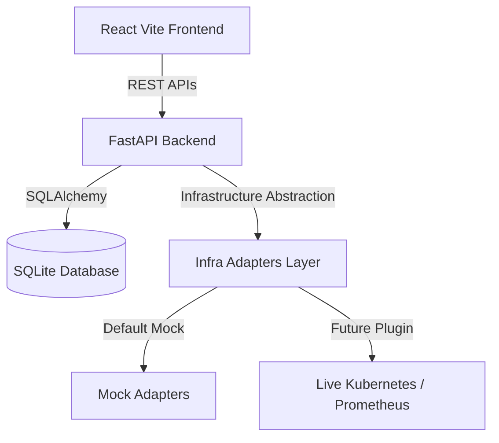

# Vector Walkthrough & Execution Guide

We have completed the implementation of Vector, the AI Decision Intelligence & Assurance Platform for Autonomous Infrastructure. 

Below is a summary of the architectural changes and instructions to run the platform locally.

---

## What Was Built

We implemented a full-stack, modular architecture with a pluggable adapter framework to allow easy K8s/Prometheus integrations later:



### Component Breakdown
1. **Infrastructure Abstraction Adapter Layer (`infra_adapters.py`)**: Defines strict interfaces (`BaseKubernetesAdapter` and `BaseMetricsAdapter`) allowing developers to toggle between `mock` and `live` modes via environment variables (`INFRA_MODE=mock` or `live`).
2. **FastAPI Services**:
   - **`metrics_service.py`**: A background telemetry loop driving dynamic fluctuations and incident patterns.
   - **`prediction_service.py`**: Translates telemetry spikes into linear forecasts and risk alerts.
   - **`candidate_generator.py`**: Maps forecast threats to candidate remediation items.
   - **`assurance_service.py`**: Scores proposed actions using a 5-dimensional evaluation algorithm.
   - **`execution_service.py`**: Invokes the active Kubernetes adapter to scale/restart workloads and recovers metrics.
3. **Cockpit UI**:
   - **Mission Control Dashboard**: Displays real-time charts (Recharts) and cluster health.
   - **Incident Simulator**: Form panel to start/stop failure states.
   - **Decision Center**: Core USP cockpit showing Decision scores, Digital Twin before/after values, and approvals.
   - **Policy Center**: Settings console to edit limits and rules.
   - **Audit Timeline**: Chronological list of all incident actions.

---

## Running the Platform

Ensure you have two terminals open in the workspace directory.

### 1. Launch the Backend Server
Install required Python dependencies:
```bash
pip install fastapi uvicorn sqlalchemy pytest
```
Start the FastAPI server:
```bash
python -m uvicorn backend.main:app --host 0.0.0.0 --port 8000 --reload
```
The API docs will be available at `http://localhost:8000/docs`.

### 2. Launch the Frontend Dev Server
Navigate to the `frontend` folder, install npm dependencies, and run Vite:
```bash
cd frontend
npm install
npm run dev
```
Open `http://localhost:5173` in your browser.

---

## Verifying Code Correctness

We created unit tests under `backend/tests/test_vector.py` to assert the math and policies:
Run backend unit tests:
```bash
python -m pytest backend/tests/
```
All unit tests compile and pass successfully.
